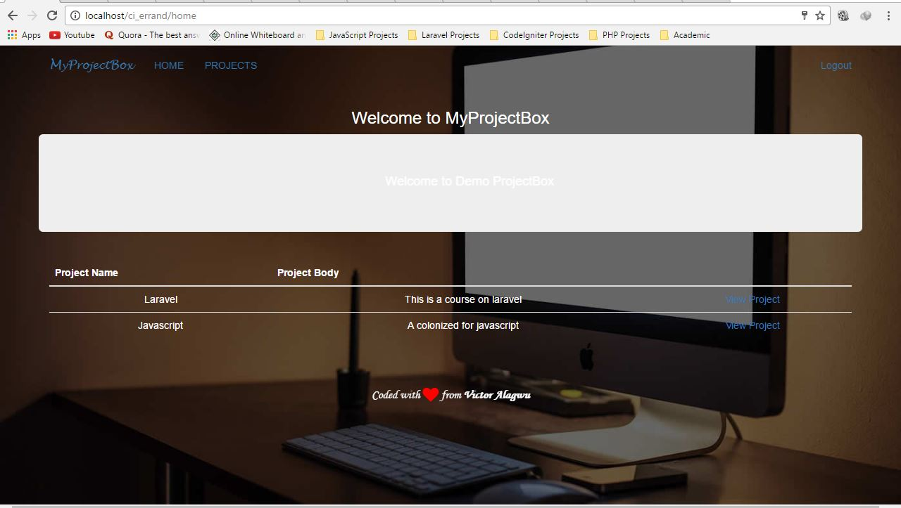
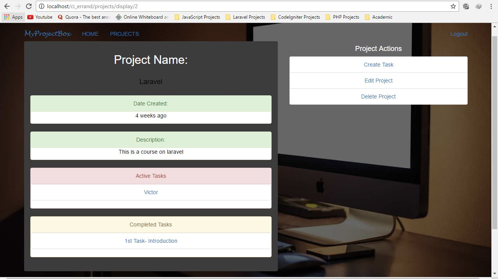
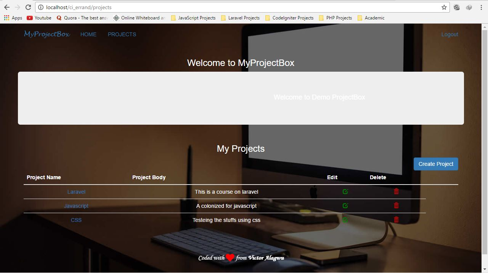
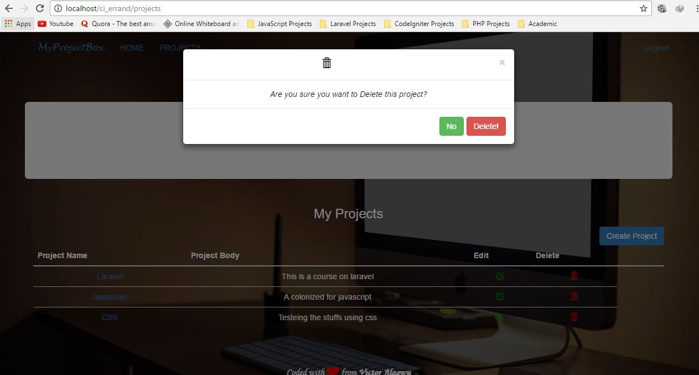
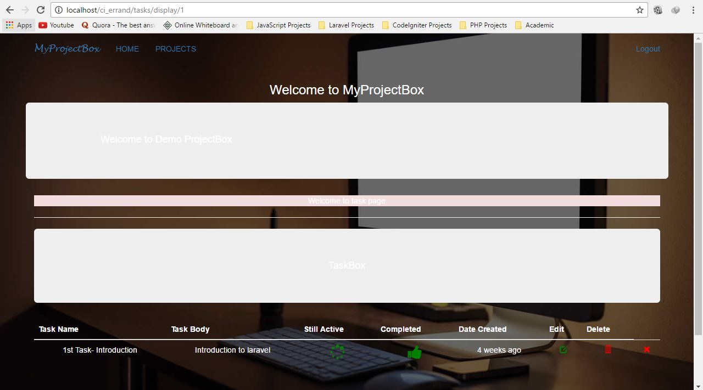
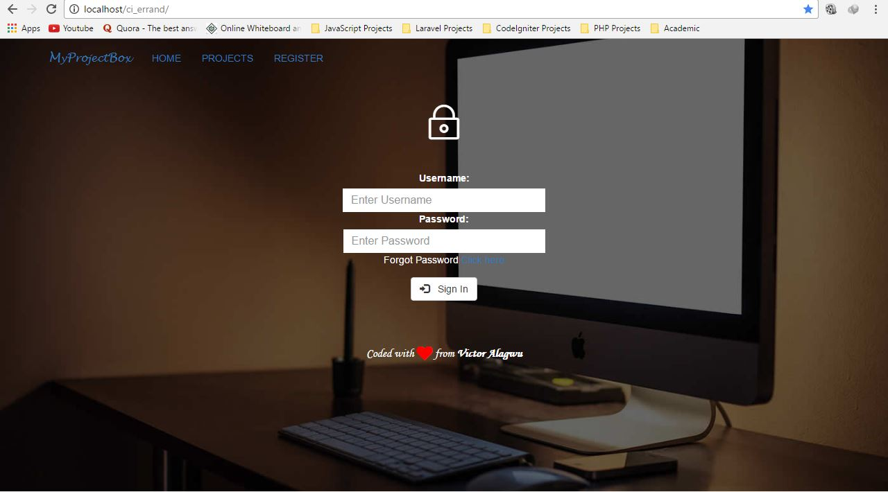
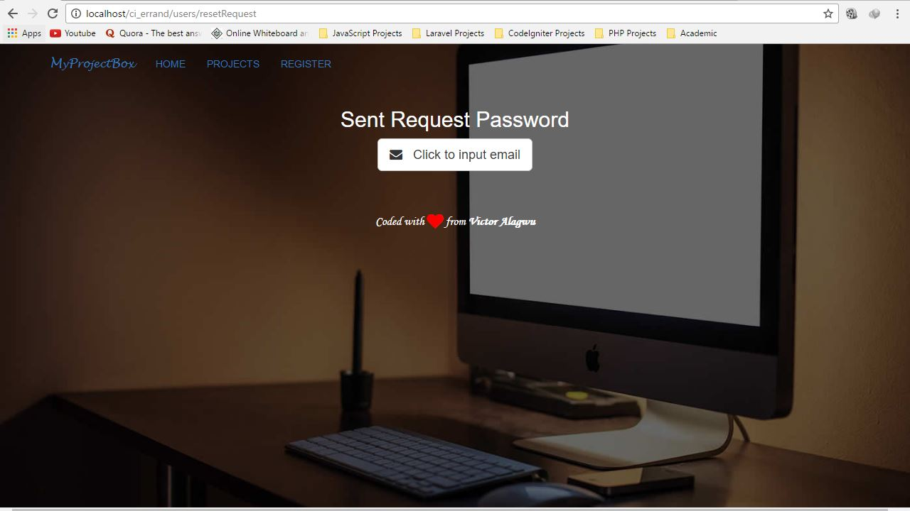
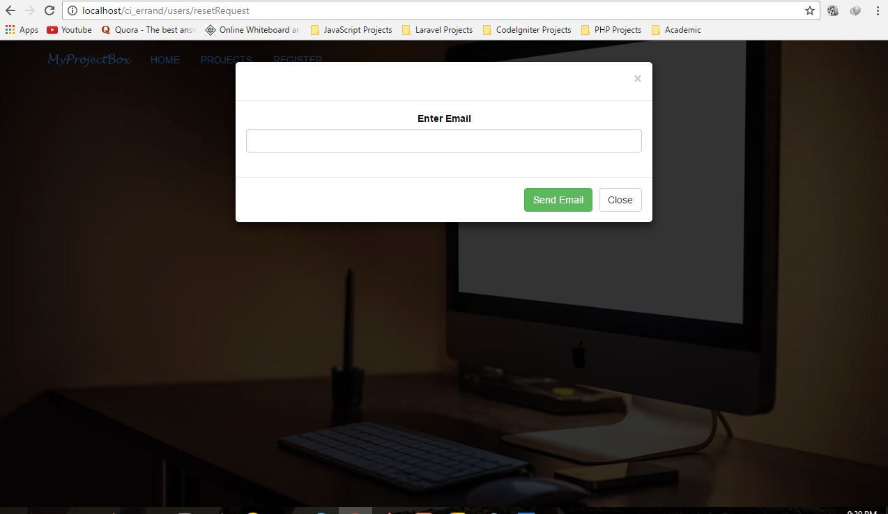

# MyProjectBox -A Management System - 

This project was done when learning **Codeigniter** using **PHP MVC Framework CodeIgniter Tutorial for Beginners Project by Edwin Diaz**, though i have to integrate some other features :smile: .

# About Project 
MyProjectBox is a small scheduling or management web application that allow users to create projects which they want to do and the various tasks to be use in ensuring that the project is done.eg when you want to learn how to design a site(Project),there are various steps you take to ensure you learn how to design a site 1.first you learn the basics of HTML,CSS and Javascript etc

# Features of the Site
--------
- **Project Page:** Allow you to view all the project you are working on.
	
	
- **Task Page:** Allow you to view the different tasks
	
- **Registration Page:** Allows Users to register
- **Local Authentication** using either Username or Email, and Password
	
- **Recover Password Page** allows users to recover their password if forgotten.
	
	
	
- **The Use of Password Hashing**
- **Time feature:** I know it is not big deal :wink:,but i just feel like writing this down. :innocent:

# Tools used
-------------

- Mysql
- PHP
- Bootstrap
- Ajax

Contributing
-----------

- Do the following change the code in the 'codeigniter.sql'
- After that you are done,register and login
- "Just view the project"
:relieved:  :joy:
	
 
